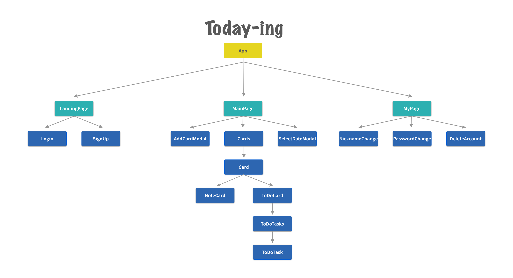

</img> 

# **Todaying :pencil2::blue_book:**

팀명 : dayfly 
프로젝트명 : Todaying 
설명 :  **'Todaying'**은 하루에도 기억하기 힘들 정도로 많은 일을 처리하는 사람들을 위한 앱입니다. 
데일리 노트용으로도 사용이 가능하며, 일기처럼 과거에 어떤 일을 했었는지 등을 기록해놓을 수도 있고, 
반대로 미래에 어떤 일을 해야 할지 기입할 수도 있습니다. 
일반적인 ToDoList와는 차별화된 서비스를 제공하는 Todaying 앱을 만나보세요! :smiley: :thumbsup:

---------------------------------------
# **Development Stack:computer:**

>

>

---------------------------------------
# **Workflow**:rainbow:
**Client-Side(React Components)** 

</img> 

**Server-Side(Data Schema)** 

</img> 

# ** Service URL **

https://todaying.cf

🏠 https로 내집마련 
